# Mo Salah Fan Page

The Mo Salah Fan Website is a visually engaging, responsive fan page dedicated to celebrating the legacy of Mohamed Salah. The project showcases modern web development practices, including responsive design, semantic HTML5, and CSS3 styling. This website was built as part of my learning journey in the Code Institute Full Stack Developer Course, highlighting key skills in user-centric design, coding standards, and deployment.

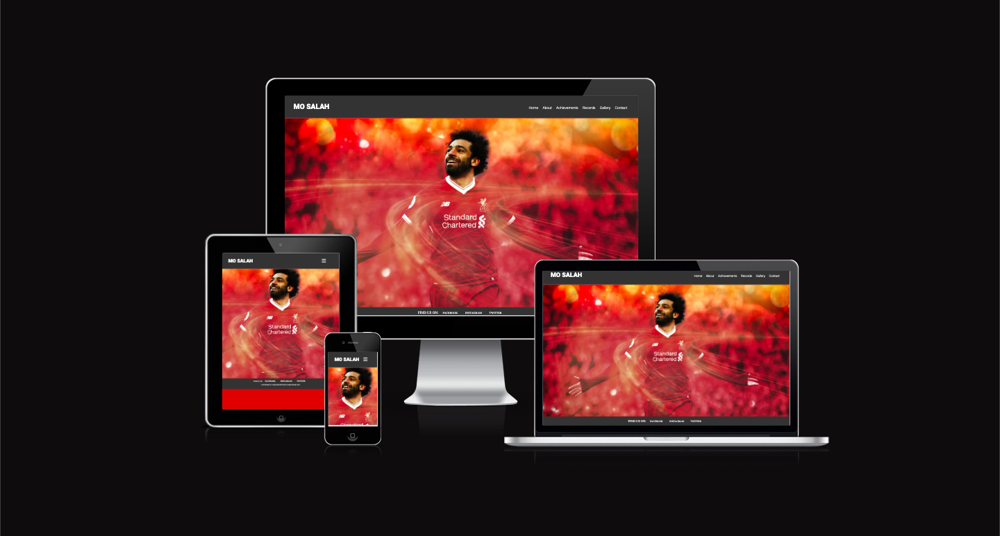

[View the project here](https://github.com/Omar6688/Salah)

---

## Table of Contents

### [User Experience (UX)](#user-experience-ux)
   * [User Stories](#user-stories)
   * [Design](#design)

### [Features](#features)
   * [Existing Features](#existing-features)
   * [Features Left to Implement](#features-left-to-implement)

### [Technologies Used](#technologies-used)
   * [Frameworks, Libraries & Programs Used](#frameworks-libraries--programs-used)

### [Testing](#testing)
   * [Validation Results](#validation-results)
   * [Manual Testing](#manual-testing)
   * [Lighthouse Report](#lighthouse-report)

### [Deployment and Local Development](#deployment-and-local-development)
   * [GitHub Pages](#github-pages)
   * [Forking the GitHub Repository](#forking-the-github-repository)
   * [Local Clone](#local-clone)

### [Credits](#credits)

### [Acknowledgements](#acknowledgements)

---

## User Experience (UX)

This fan page is designed to celebrate Mohamed Salah's incredible football journey, achievements, and legacy. It provides a user-friendly and responsive experience for all visitors.

### User Stories

 * **First-time visitors**
    * Learn about Mo Salah’s career and achievements through a clean and engaging interface.
    * Navigate effortlessly to different sections of the website using a responsive menu.
    * Enjoy browsing a gallery of images showcasing Salah’s journey.

 * **Returning visitors**
    * Revisit sections for updates on features or new content.
    * Revisit the gallery to check for newly added photos.
    * Use the quiz feature to engage with fun, interactive content.
    * Share their thoughts through the contact form.
    * Share links to the page with other fans.

 * **Frequent users**
    * Bookmark their favorite pages (e.g., records or achievements).    
    * Engage with planned interactive features such as galleries or testimonials.
    * Stay informed about updates to Salah’s legacy.

---

## Design

 * **Color Scheme**: The website incorporates a bold and modern color palette inspired by Liverpool FC:
    * #D00027 (Red): For headers and key highlights.
    * #FFFFFF (White): For text and clean sections.
    * #333333 (Dark Gray): For footer and navigation backgrounds.

 * **Typography**: The site uses two fonts from Google Fonts:
    * Raleway: For headings and titles, providing a modern and elegant look.
    * Roboto: For body text, ensuring readability and simplicity.

 * **Wireframes**: The wireframes for the Mo Salah Fan Website were created using Figma. The purpose of these wireframes was to establish a clear and intuitive design layout, ensuring optimal user experience across devices. Each page focuses on simplicity, responsiveness, and accessibility.
    * Home Page: A welcoming introduction to Mo Salah’s legacy.    
    * About Page: Detailed biography of Mohamed Salah.    
    * Achievements Page: howcases key career milestones.    
    * Records Page: Lists records held by Mo Salah.    
    * Gallery Page: Displays an engaging collection of images.     
    * Contact Page: Includes a form to contact the fan club and a quiz entry.
    * Quiz Entry Received Page: Confirmation page after form submission.   

---

## Features

* **Responsive Design**: This site is fully responsive on all devices, with separate styling for mobile, tablet, and desktop screens.
* **Navigation Bar**: A sticky navigation bar is consistent across all pages, allowing easy access to different sections.

### Existing Features

* **Header and Navigation
   * Contains links to Home, About, Achievements, Records, Gallery, and Contact.
   * Responsive hamburger menu for mobile devices.

    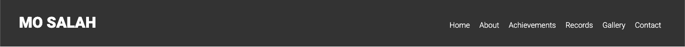

* **Home Page**
   * Includes a welcoming hero section featuring Mo Salah’s image.
   * A navigation bar with links to all pages, ensuring easy access.
   * A footer with social media links and copyright information.

    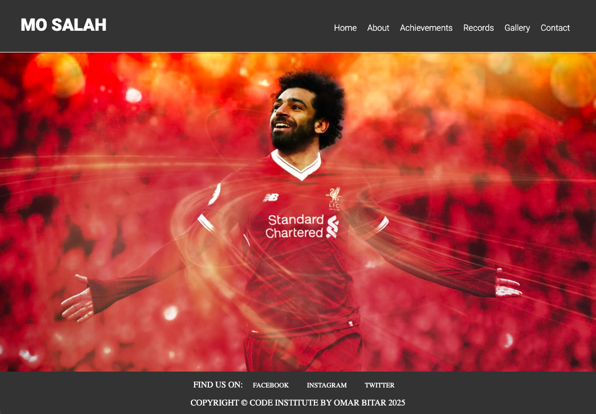

* **About Page**
   * A clean and structured layout highlighting Mohamed Salah's biography.
   * Includes collapsible sections (using 
 tags) to provide concise information on key moments in his life.    

    

* **Achievments Page**
   * Highlights major career milestones in a list format.
   * Organized with headings for different teams or competitions (e.g., Liverpool, Basel, International).    

    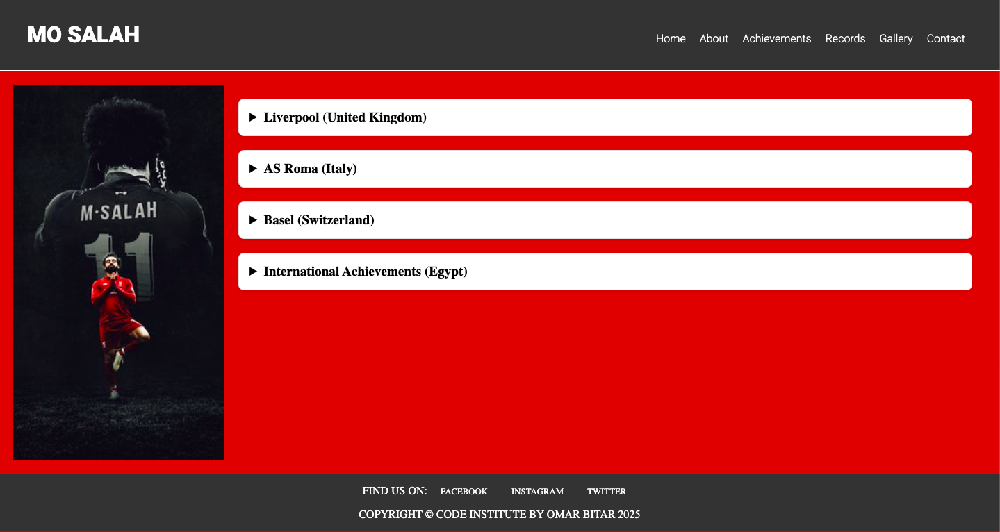

* **Records Page**
   * Displays records in categorized sections, such as Club Records, International Records, and Premier League Records.
   * Incorporates a full-width embedded video for engagement.
    
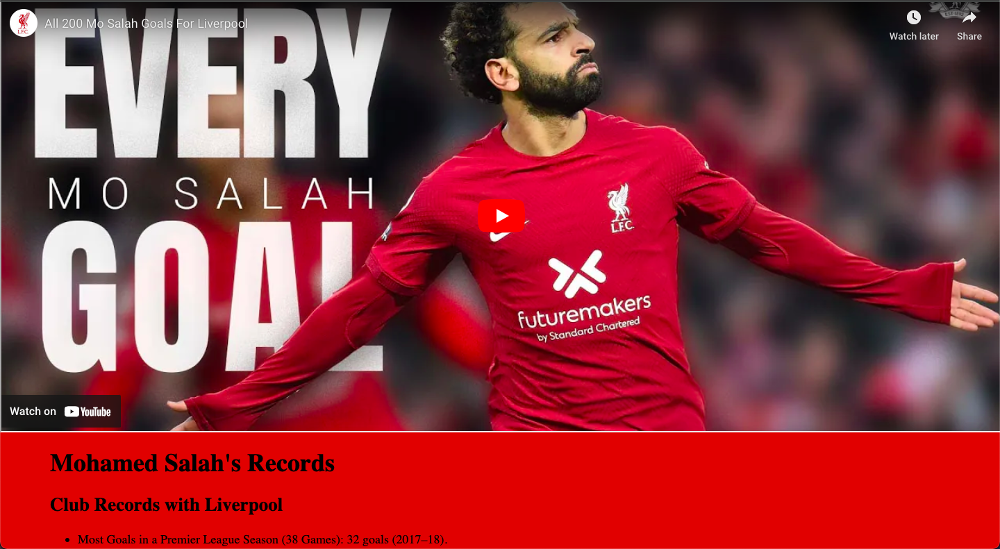

* **Gallery Page**
   * A responsive grid layout showcasing images of Mo Salah.
   * Includes hover effects for image interactivity.
   * Option to implement a lightbox feature for larger image previews in future iterations.

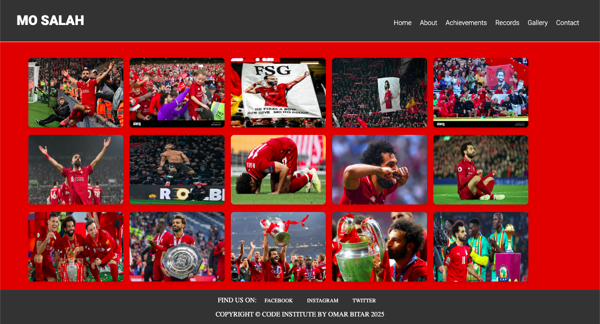

* **Contact Page**
   * Features a user-friendly contact form for quiz entry or inquiries.
   * Form includes fields for name, email, country, age, and a message box.
   * A "Thank You" page is displayed upon successful form submission.

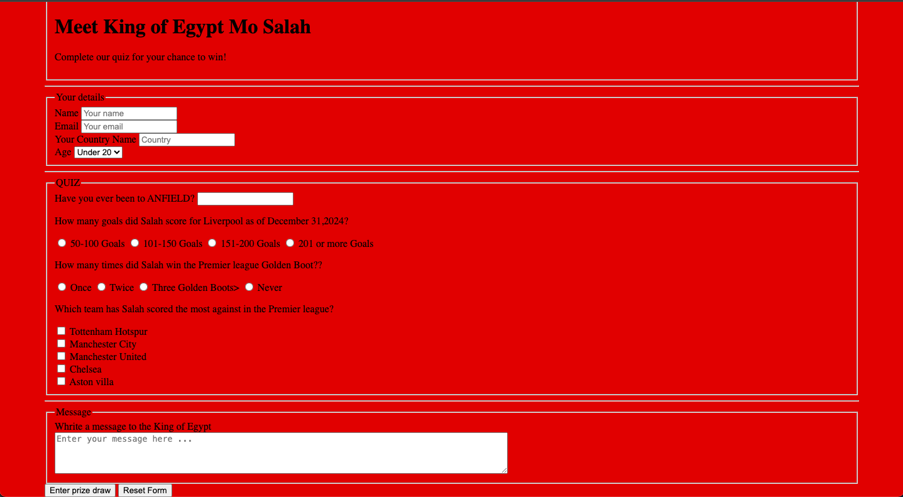

* **Quiz Entry Received Page**
   * A simple confirmation page thanking users for their quiz submission.
   * Includes a call-to-action button linking back to the homepage.

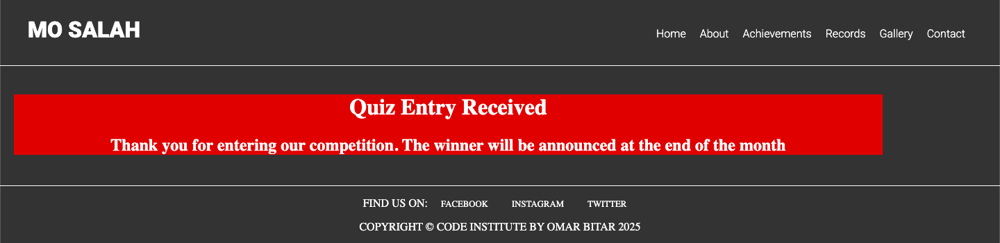

* **Footer**
    * Links to social media for easy access.
    * Copyright and attribution information.

    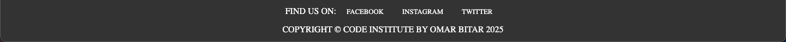

---

## Features Left to Implement

* Add animations to the gallery for enhanced user engagement.
* Backend integration for form submissions.
* Leaderboard to display quiz results.
* Lightbox feature for viewing gallery images in larger formats.
* Dynamic content updates for new records and achievements.

---

## Technologies Used

 * **HTML5**: For the structure of the website.
 * **CSS3**: For the styling of the website.

---

## Frameworks, Libraries & Programs Used

 * **Git**: Version control.
 * **GitHub**: Repository hosting and deployment.
 * **Google Fonts**: To import Inter and Open Sans fonts.
 * **Font Awesome**: For icons.
 * **Am I Responsive**: To preview the responsive design for this README.
 * **Figma**: Used For wireframe design.

---

## Testing

This project was tested extensively to ensure compatibility and usability across devices and browsers.

### Validation Results

* **HTML**: Validated using the [W3C Markup Validator](https://validator.w3.org/).
* **CSS**: Validated using the [W3C CSS Validator](https://jigsaw.w3.org/css-validator/).

index.html

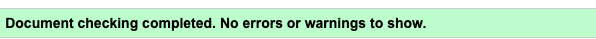)

projects.html

thank-you.html

style.css

### Manual Testing

The following tests were conducted to ensure full functionality across pages:

* **Layout Testing**
   * Verified responsive layout adjustments on mobile, tablet, and desktop views to ensure elements displayed as intended across various screen sizes.
   * Checked that images, text, and buttons align correctly and adapt to the screen size on each device.

* **Back Button Testing**
   * Verified that the back button on the "Projects" page redirects correctly to the main page.
   * Confirmed that the back button on the "Thank You" page after form submission redirects back to the main page.

* **Form Functionality**
   * Tested that all form fields accept input and require completion before submission.
   * Verified that submitting the form redirects to the "Thank You" page with a confirmation message.

* **Navigation Testing**
   * Ensured navigation links work correctly, directing to the correct sections on both tablet and desktop views without blocking section headers (excluding Contact).

### Lighthouse Report

#### Desktop

index.html

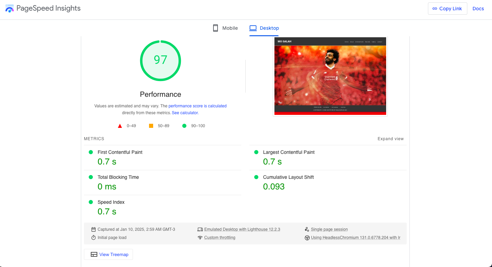

gallery.html

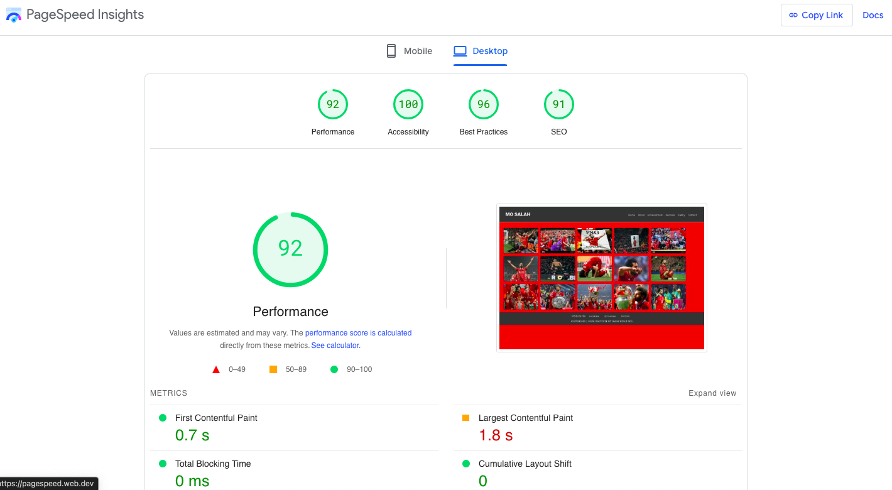

achievments.html

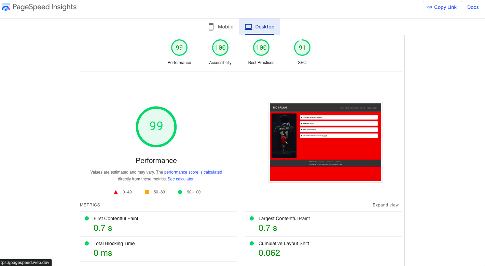

#### Mobile

index.html

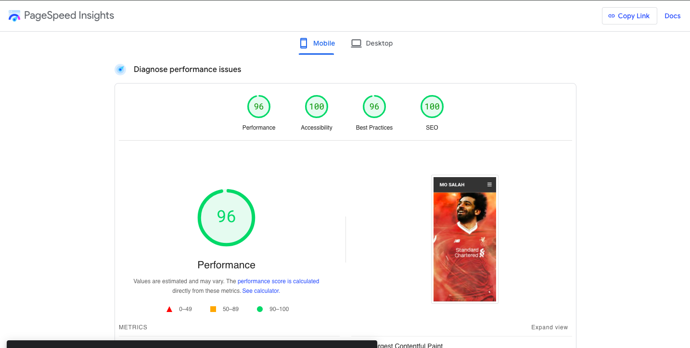

gallery.html

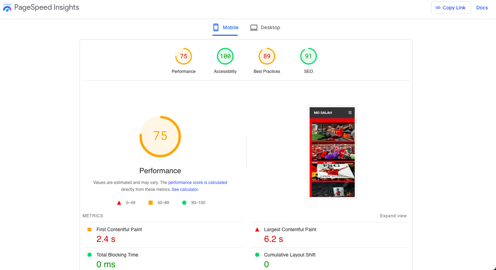

achievments.html

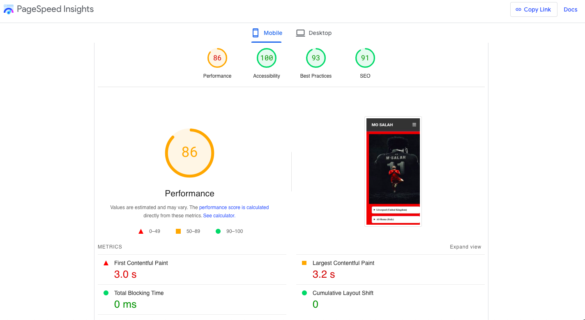

---

## Deployment and Local Development

### GitHub Pages

GitHub Pages used to deploy live version of the website.
1. Log in to GitHub and locate [GitHub Repository Salah](https://github.com/Omar6688/Salah)
2. At the top of the Repository locate "Settings" button on the menu.
3. Scroll down the Settings page until you locate "GitHub Pages".
4. Under "Source", click the dropdown menu "None" and select "Main" and click "Save".
5. The page will automatically refresh.
6. Scroll back to locate the now-published site [link](https://Omar6688.github.io/Salah/index.html) in the "GitHub Pages" section.

### Forking the GitHub Repository

By forking the repository, we make a copy of the original repository on our GitHub account to view and change without affecting the original repository by using these steps:

1. Log in to GitHub and locate [GitHub Repository Salah](https://github.com/Omar6688/Salah)
2. At the top of the Repository(under the main navigation) locate "Fork" button.
3. Now you should have a copy of the original repository in your GitHub account.

### Local Clone

1. Log in to GitHub and locate [GitHub Repository Salah](https://github.com/Omar6688/Salah)
2. Under the repository name click "Clone or download"
3. Click on the code button, select clone with HTTPS, SSH or GitHub CLI and copy the link shown.
4. Open Git Bash
5. Change the current working directory to the location where you want the cloned directory to be made.
6. Type `git clone` and then paste The URL copied in the step 3.
7. Press Enter and your local clone will be created.

---

## Credits

### Code

* Responsive layout techniques and Flexbox concepts from [CSS Tricks](https://css-tricks.com/).
* Grid layout patterns and form styling assistance from [MDN Web Docs](https://developer.mozilla.org/).
* README file structure guidance from [Code Institute](https://github.com/Code-Institute-Solutions/SampleREADME).

### Content

* Content Created by the developer as part of the Code Institute course.

### Media

* [Unsplash](https://https://unsplash.com//) Used for images.
* [Pexels](https://www.pexels.com/) Provided free stock photos used throughout the portfolio.

---

## Acknowledgements

* Huge thanks to my mentor Gareth, for the great support, helpful advice and incouragment that kept this project on track.
* Shoutout to the Stack Overflow community – their answers and discussions were a lifesaver for solving tricky issues along the way.

